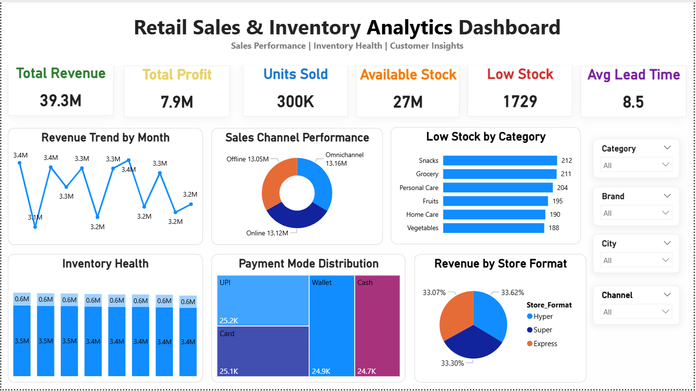

# 📊 FMCG Retail Dashboard

An interactive FMCG Retail Dashboard built using Microsoft Power BI to analyze sales performance, inventory, and retail business insights.

---

## 📸 Dashboard Preview

---

## 📌 Project Overview

This project analyzes retail sales, inventory, and business performance using Microsoft Power BI. The dataset was cleaned in Microsoft Excel, analyzed using SQL queries in SQL Server Management Studio (SSMS), and visualized through an interactive Power BI dashboard to identify sales trends, product performance, inventory levels, and customer purchasing patterns.

---

## 🛠️ Tools Used

- Microsoft Excel
- SQL Server Management Studio (SSMS)
- Microsoft Power BI
- DAX

---

## 📂 Dataset

- FMCG Retail Dataset (Cleaned CSV)
- The dataset was cleaned in Microsoft Excel before importing into SQL Server Management Studio (SSMS) and Power BI for analysis.

---

## 📈 Dashboard Features

- Total Revenue KPI
- Total Profit KPI
- Units Sold
- Available Stock
- Low Stock Items
- Average Lead Time
- Revenue Trend by Month
- Sales Channel Performance
- Low Stock by Category
- Inventory Health
- Payment Mode Distribution
- Revenue by Store Format
- Interactive Filters (Category, Brand, City, Channel)
  
---

## 💡 Key Insights

- The dashboard provides an overview of retail revenue, profit, units sold, and inventory levels.
- Low stock analysis helps identify categories that require immediate restocking.
- Sales performance varies across different sales channels and store formats.
- Payment mode distribution provides insights into customer purchasing preferences.
- Monthly revenue trends help monitor business performance over time.
- Interactive filters allow detailed analysis by category, brand, city, and sales channel.

---

## 📁 Project Files

- FMCG_Retail_Dashboard.pbix
- FMCG_Retail_Dashboard.png
- FMCG_Retail_Dataset_Cleaned.csv
- FMCG_Retail_Analysis_SQL_Queries.sql

---

## 🚀 Skills Demonstrated

- Data Cleaning
- SQL Data Analysis
- SQL Aggregation & CASE Statements
- Data Transformation
- DAX Measures
- KPI Design
- Dashboard Design
- Data Visualization
- Business Insights

---

⭐ Thank you for visiting this project!
